# BrandSentimentAnalysis
Sentiment analysis of brand perception for personal care products: A comparative study between P&G and Unilever.

# Brand Sentiment Analysis: P&G vs. Unilever

This project performs sentiment analysis on consumer reviews of personal care products to compare brand perception between Procter & Gamble (P&G) and Unilever in the Turkish e-commerce market.

## Project Objective

The goal is to develop a context-sensitive sentiment analysis model tailored to Turkish user reviews collected from Trendyol. It analyzes comments on deodorants, shampoos, and oral care products to gain insights into customer satisfaction and brand reputation.

## Methods and Tools ⚙️

- **Data Source:** ~26,000 reviews scraped from Trendyol, cleaned to ~17,000 relevant comments.
- **Preprocessing:** Noise filtering, typo correction, stopword removal, manual annotation.
- **Vectorization:** TF-IDF with n-grams.
- **Models Tested:** Logistic Regression (custom), SVM, Random Forest, XGBoost, and a pre-trained BERT (`savasy/bert-base-turkish-sentiment-cased`).
- **Evaluation Metrics:** Accuracy, Precision, Recall, F1-Score.

## Key Results

- The custom Logistic Regression model achieved 92% accuracy.
- Random Forest outperformed all with 94.1% accuracy.
- BERT performed well but misclassified short, ambiguous comments more often.
- Overall, no major sentiment gap was found between P&G and Unilever — except that Unilever performed better for men's shampoos.

## Technologies

- Python, Pandas, Scikit-learn, NumPy, Matplotlib
- XGBoost, SQLite, Google Colab

## Dataset 📁

Comments were manually labeled as positive or negative. Neutral comments and irrelevant aspects (shipping, seller behavior) were excluded for clarity.

---

## 📂 Notebooks

- **`datacleaning_labeling.ipynb`**: Raw dataset is cleaned (noise removal, typo correction, stopwords) and manually labeled for sentiment classification.
- **`custommodel_pretrained.ipynb`**: Trains a custom Logistic Regression model and uses the cleaned dataset to generate sentiment labels with a pre-trained BERT model and evaluates its performance.
- **`custommodelvspretrained.ipynb`**: Compares the custom Logistic Regression model with the pre-trained BERT model on the same dataset.
- **`mlcomparision.ipynb`**: Compares multiple machine learning models (SVM, Random Forest, XGBoost) using TF-IDF features.
- **`visualization.ipynb`**: Generates visualizations to interpret the sentiment results by category, brand, and rating alignment.

---

## 📸 Images

Below are some visualizations generated during the analysis:

### Sentiment per Category
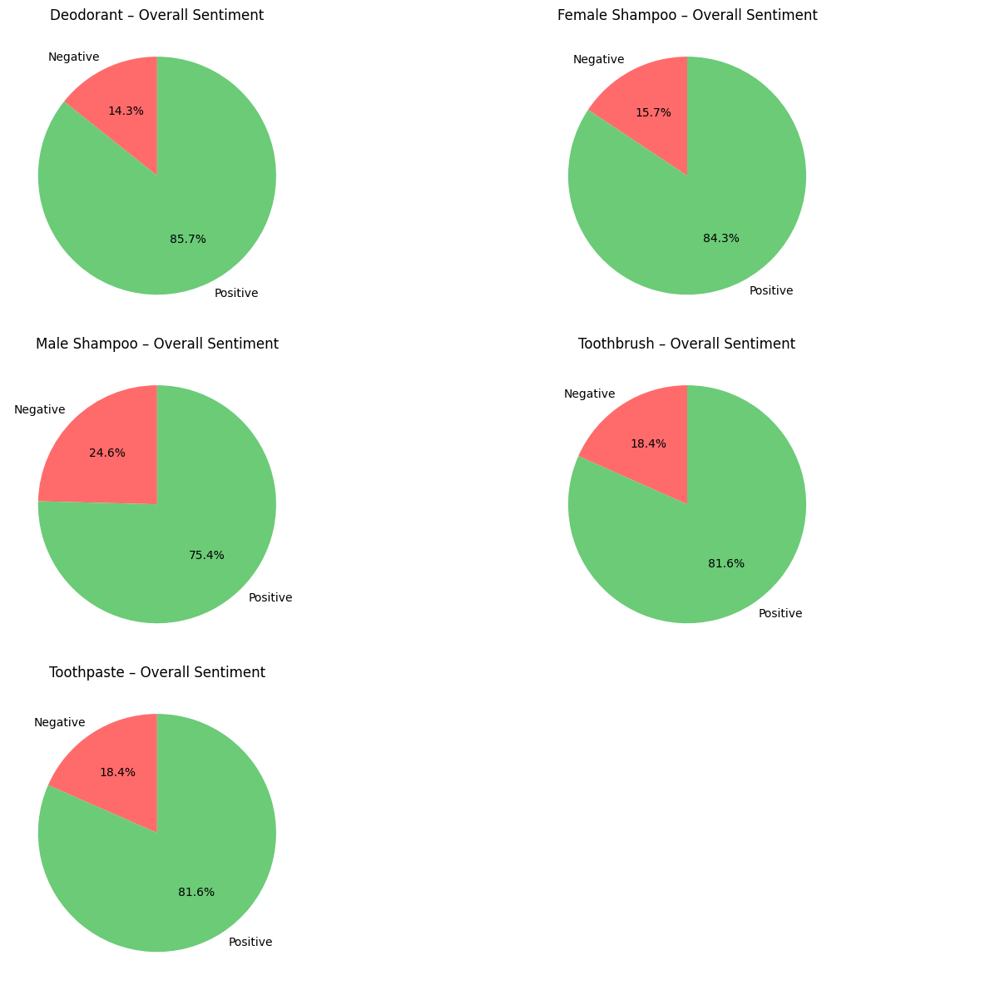

### Sentiment per Brand
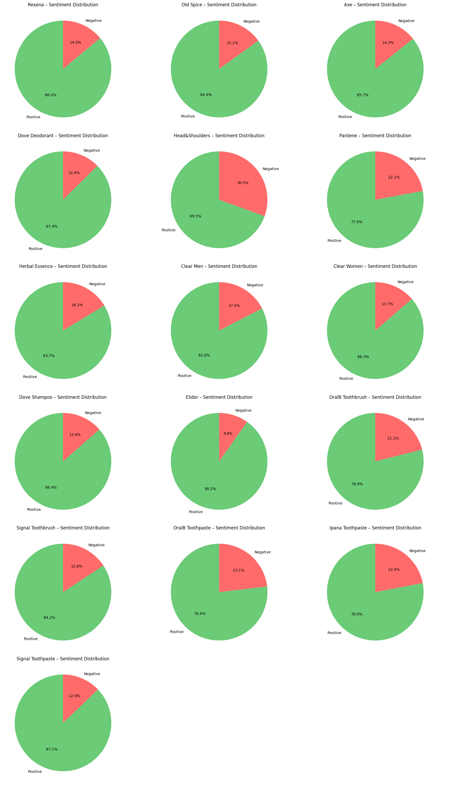

### Sentiment vs Product Rating (Scatter Plot)
.png)

### Alignment Between Ratings and Sentiment
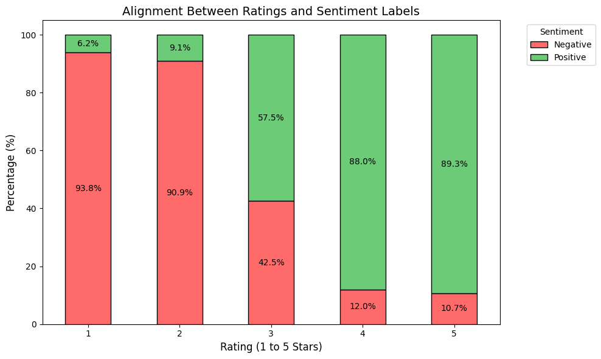

### Monthly Sentiment Distribution
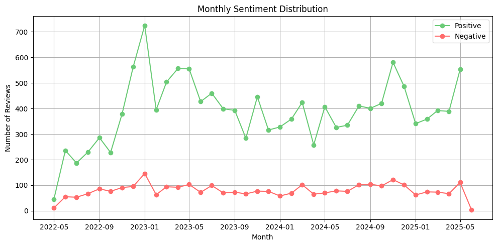

### Monthly Total Reviews
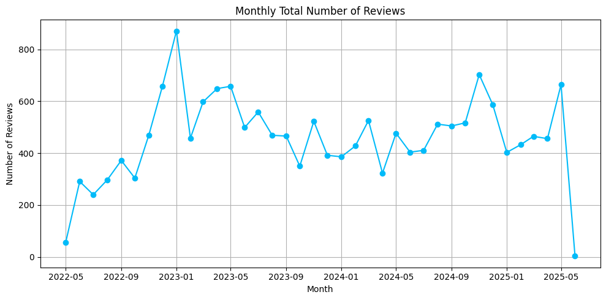

### Negative Reviews in November
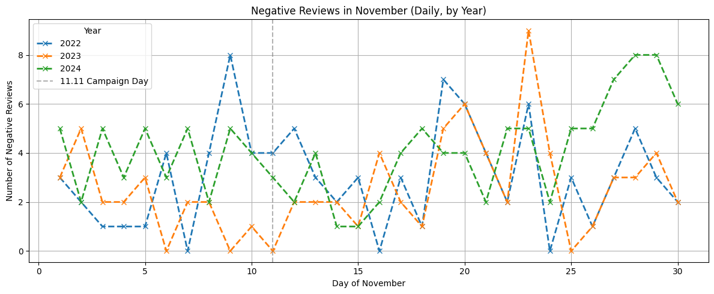

### Positive Reviews in November
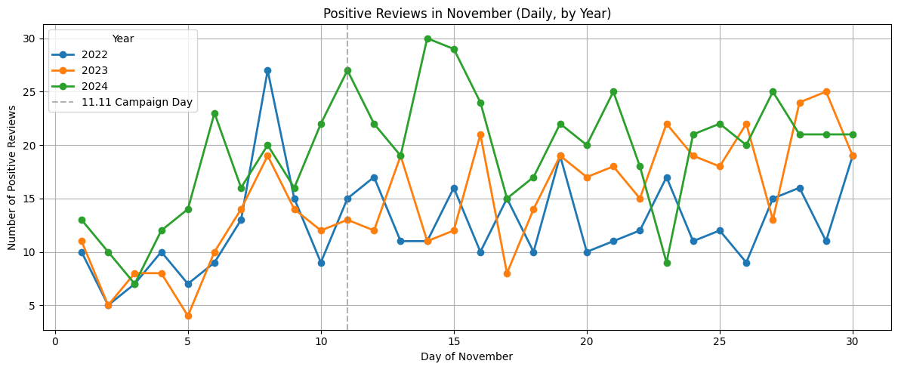

### Percentage of Positive and Negative
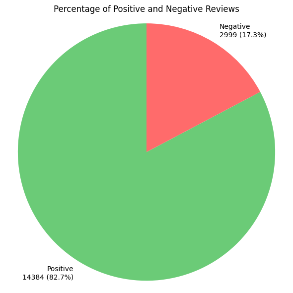

### Sentiment Distribution by Brand & Product Type
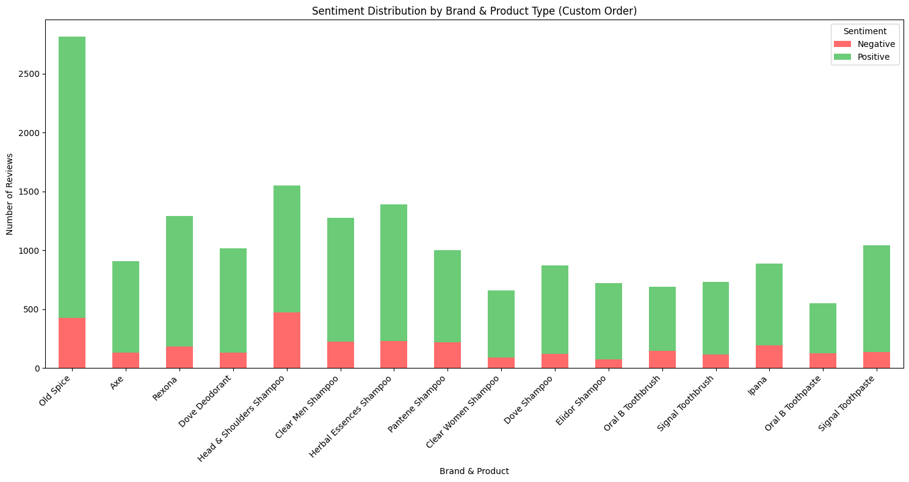

### Sentiment Distribution by Category and Company
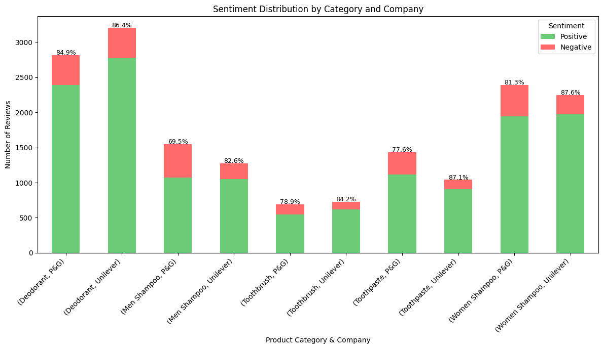

### Top 5 Brands with Negative Reviews
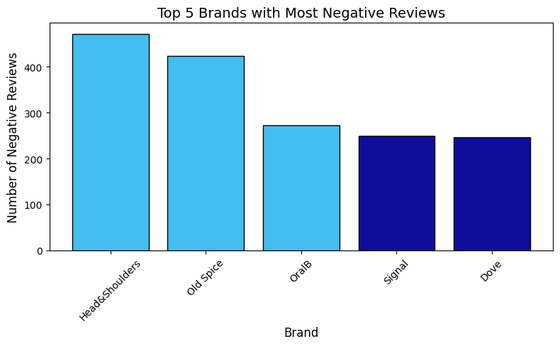

### Top 5 Brands with Positive Reviews
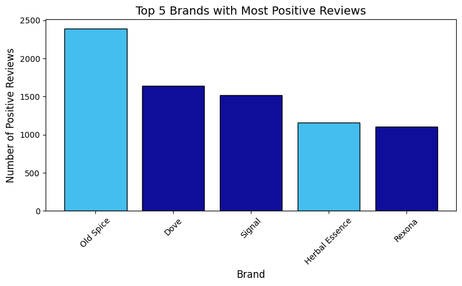

### Total Number of Reviews by Category
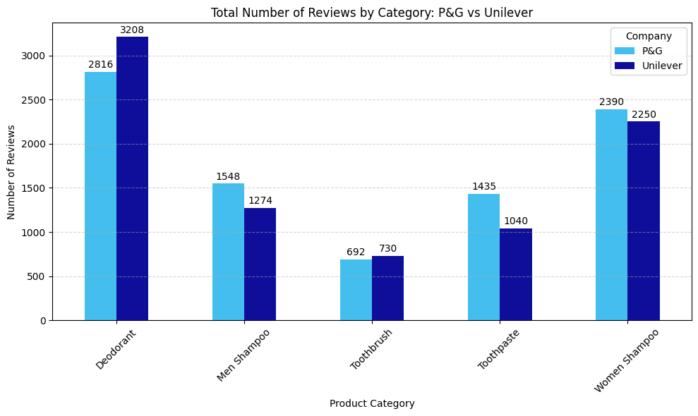

### Word Cloud - Negative Reviews
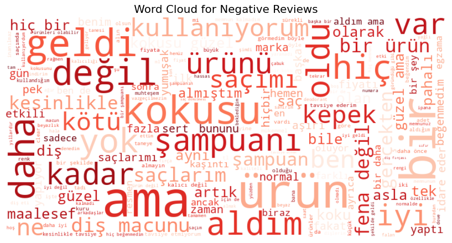

### Word Cloud - Positive Reviews
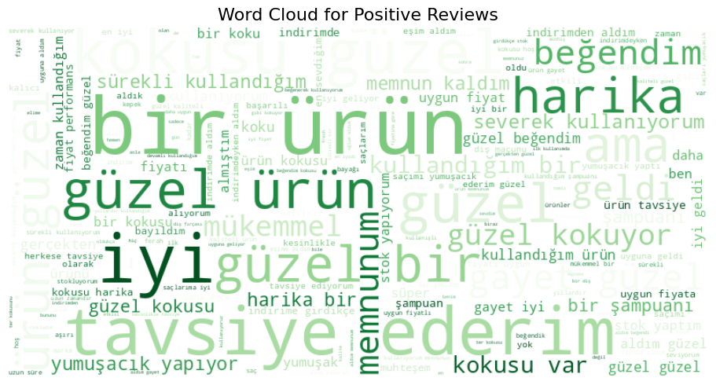

---

## Conclusion

This project shows how a domain-specific, linguistically adapted model can improve sentiment analysis in agglutinative languages like Turkish, especially for local e-commerce contexts.

---

**Keywords:** Sentiment Analysis, Turkish NLP, TF-IDF, Logistic Regression, BERT, Machine Learning, Brand Perception.
